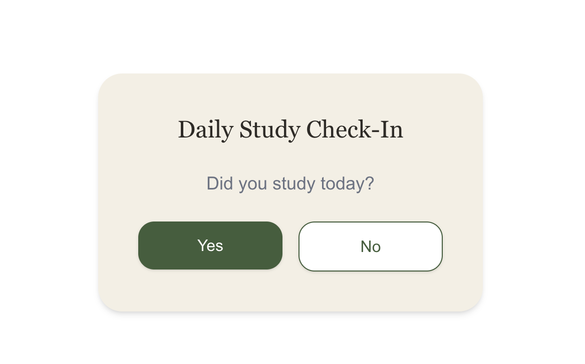
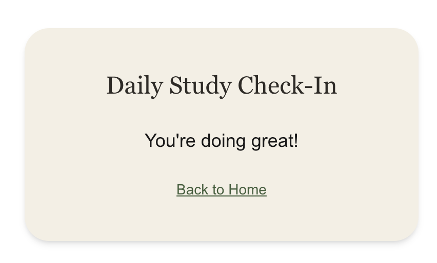
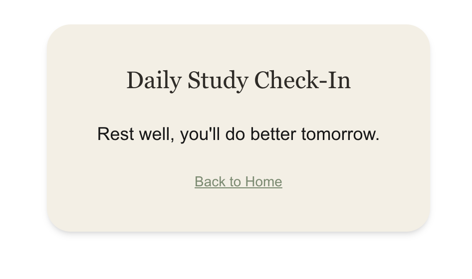

# Daily Study Check-In

A minimal Single Page Application built with Next.js and TypeScript. The app asks the user one simple question — "Did you study today?" — and responds with an encouraging message based on their answer.

## What the App Does

1. **Header**: Displays the app title, "Daily Study Check-In".
2. **Question**: Asks the user "Did you study today?"
3. **Check-In Buttons**: Exactly two buttons, "Yes" and "No", for the user to answer.
4. **Positive Message**: If the user selects "Yes", one message is randomly chosen from a list of positive messages (e.g. "You're doing great!") and displayed.
5. **Supportive Message**: If the user selects "No", one message is randomly chosen from a list of supportive messages (e.g. "Take a good rest today and try again tomorrow.") and displayed.
6. **Return Home Button**: After a message is shown, a "Back to Home" button resets the app back to the question screen.

## Screenshots

## Components

- `Header`
- `Question`
- `CheckInButtons`
- `PositiveMessage`
- `SupportiveMessage`
- `ReturnHomeButton`

## Data

- `data/messages.ts` — arrays of positive and supportive messages, plus a `getRandomMessage` helper that picks one at random.

## Types

- `types/checkIn.ts` — defines `CheckInAnswer` (`"studied" | "notStudied" | null`) to track the user's answer.

## Tests

Located in the `__tests__` directory:
- `Header.test.tsx`, `Question.test.tsx`, `CheckInButtons.test.tsx`, `PositiveMessage.test.tsx`, `SupportiveMessage.test.tsx`, `ReturnHomeButton.test.tsx`, `messages.test.ts`, `integration.test.tsx`

Unit tests cover `getByRole`, `getAllByRole`, `queryByRole`, and two event types (`click` and `keyDown`). Integration tests in `integration.test.tsx` verify state changes across the full user flow: question → message → back to question.